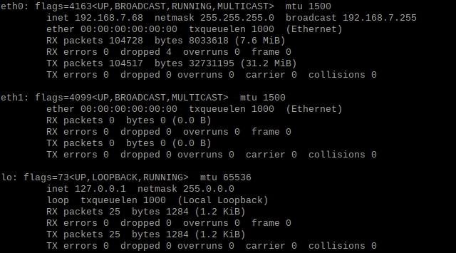

# TCPDumpAsService
This is a basic how to for setting up tcpdump to passively montior network traffic.
In this instance, it is implemented thru a Raspberry Pi using Raspbian Buster Version 10 on a dedicated ethernet interface of eth1.

## Configure ethernet connection
### Determine the ethernet adapter interface that is going to be used
```shell
ifconfig
```


### Put adapter in promiscuous mode
Promiscuous mode will allow the adapter to read all traffic allong the line that it can, even if it is not meant for it

#### Make a backup of `dhcpcd.conf`
```shell
sudo cp /etc/dhcpcd.conf /etc/dhcpcd.conf.bak
```
#### Set the address of nothing to the specified adapter
```shell
echo 'static' >> /etc/dhcpcd.conf
echo 'interface eth1' >> /etc/dhcpcd.conf
echo 'static ip_address=0.0.0.0' >> /etc/dhcpcd.conf
```
#### To for changes to take effect
```shell
sudo reboot now
```
### Create a service 
Create <a href="promisc.service">promisc.service</a> file
```shell
sudo nano /etc/systemd/system/promisc.service
```
Paste the service file in there
```shell
[Unit]
Description=Put an interface in promiscuous mode during bootup
After=network.target

[Service]
Type=oneshot
ExecStart=/bin/ip link set eth1 promisc on
TimeoutStartSec=0
RemainAfterExit=yes

[Install]' >> /etc/systemd/system/promisc.service
WantedBy=default.target
```
To Save `Ctrl+X and Y and <Enter>`

Reload the services, enable the newly created service past reboot, and starts it
```shell
sudo systemctl daemon-reload
sudo systemctl promisc enable
sudo systemctl promisc start
```


## Install and configure tcpdump
### Install tcpdump
If `tcpdump` isn't already installed, it needs to be
```shell
sudo apt-get install tcpdump
```

### Setup the tcpdump service
Create the <a href="tcpdump.service">tcpdump.service</a> file
```shell
sudo nano /etc/systemd/system/tcpdump.service
```

Paste the service file in there.  Make sure that the location is updated where you want the files to go.
```shell
[Unit]
Description=Tcpdump service
After=network.target

[Service]
ExecStart=/usr/sbin/tcpdump -v -tttt -i eth1 -w /location/file -W 100 -C 1000
WorkingDirectory=/location
StandardOutput=inherit
StandardError=inherit
Restart=always
RestartSec=30
TimeoutSec=5
ExecStop=/bin/kill -s QUIT $MAINPID

[Install]
WantedBy=multi-user.target
```
In that Service file:
> -i eth1 is the interface that it's pulling from
> -w /location/file is the file that it's reading into
> -W is the number of files
> -C is the size of the files in megabytes rounded to 1,000,000

Learning more about tcpdump can be found https://www.tcpdump.org/manpages/tcpdump.1.html
